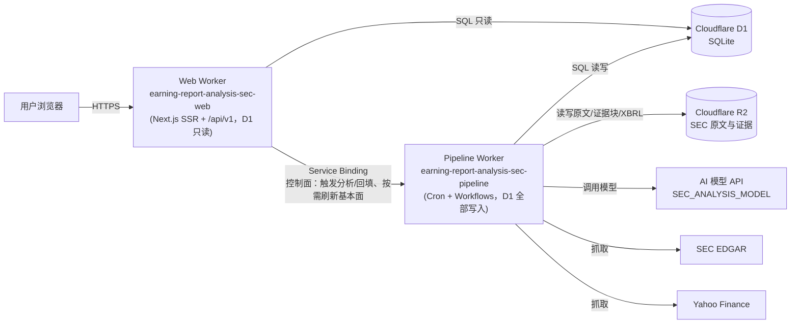

# earning-report-analysis

本项目本质上是一个面向个人投资者的 **AI 基本面分析** 应用：输入一个股票代码，就能看到这家公司历史 SEC 申报文件的原文、结构化的基本面指标图表，以及由 AI 生成、且每一条结论都能追溯回原始证据的完整研报。核心目标不是"让 AI 编一段总结"，而是把财报读成一份可追溯、可核验的判断依据——数字来自 SEC XBRL 官方数据，叙述必须引用原文证据块，事实核验不通过就不发布、保留上一版报告。

## 核心能力

- **历史 SEC 申报**：10-K / 10-Q / 8-K / 6-K 等文件持续抓取归档，前端可直接阅读 EDGAR 原文。
- **基本面指标图表**：基于 Yahoo Finance 数据源标准化后的历史序列（营收、利润率、增长率等），见 [`components/fundamentals/`](components/fundamentals/)。
- **AI 生成的单篇财报研报**：Manager 规划 → 多节点分析 → Manager Review 修复 → Synthesis 综合成稿，本期数值/同比/环比全部来自 SEC XBRL Company Facts，不是模型编造；核心事实门禁不通过则整篇失败并保留旧版本。详见 [`docs/sec-workflow-architecture.md`](docs/sec-workflow-architecture.md)。
- **AI 生成的公司整体分析（Company Analysis）**：基于基本面数据产出一份带 4 条证据支撑核心结论的公司概览。
- **组合与市场辅助信息**：宏观仪表盘、财报日历、收盘简报、持仓看板等（数据文件驱动，见 [`data/`](data/) 与 [`scripts/`](scripts/)）。

非白名单股票只读已有的历史报告；没有数据时前端显示"暂未收录"，不会触发生成。

## 技术栈

| 层 | 技术 |
| --- | --- |
| 前端/SSR | Next.js 16 (App Router) + React 19，通过 [Vinext](https://github.com/vitejs/vite-plugin-react)（Vite RSC 插件）编译为 Cloudflare Worker |
| 运行时 | Cloudflare Workers（`nodejs_compat`） |
| 数据库 | Cloudflare D1（SQLite），[Drizzle ORM](https://orm.drizzle.team/) 定义 schema 与迁移 |
| 对象存储 | Cloudflare R2（SEC filing 原文、章节、证据块、XBRL 历史） |
| 任务编排 | Cloudflare Workflows（durable、可重试的多步任务） |
| 定时任务 | Cloudflare Cron Triggers |
| 样式 | Tailwind CSS 4 |
| 测试 | Node 内置 `node:test` + `tsx`（组件渲染测试） |
| 语言/工具 | TypeScript、ESLint、Wrangler CLI |

## 项目架构

仓库是一个 **monorepo**：一份 Next.js 前端代码 + 两个独立部署的 Cloudflare Worker，共享根目录的 `lib/`、`db/` 和依赖。



两个 Worker 是两个独立的 Cloudflare 项目，各自有自己的 `wrangler.jsonc`、部署命令和密钥，但共享同一份 `lib/` 业务逻辑和根 `package.json`。**部署命令必须显式指定各自的配置文件**，不依赖 Wrangler 自动探测。

| Cloudflare Worker | 仓库目录 | 源配置 | 职责 |
| --- | --- | --- | --- |
| `earning-report-analysis-sec-web` | [`workers/web/`](workers/web/) | `workers/web/wrangler.jsonc` | Next.js SSR 页面、公开 `/api/v1` 读取接口、管理接口；对 D1 **严格只读**——只服务已经写好的分析数据，不生成任何东西 |
| `earning-report-analysis-sec-pipeline` | [`workers/pipeline/`](workers/pipeline/) | `workers/pipeline/wrangler.jsonc` | Cron 调度、`SecAnalysisWorkflow` / `SecMemoryWorkflow` / `CompanyAnalysisWorkflow` / `CompanyAnalysisBackfillWorkflow`、模型调用、R2 读写、**D1 的全部写入**（直接读写同一个数据库，不经过 Web 转手） |

**依赖只朝一个方向**：Web 可以调用 Pipeline，反过来不允许。这不是靠约定维持的——Pipeline 的 `wrangler.jsonc` 里没有任何指向 Web 的 `services` 绑定，代码里也没有 `WEB_APP_ORIGIN`，物理上就调不到 Web；它需要的一切要么来自自己的运行时配置（`SEC_TRACKED_TICKERS`），要么直接读写 D1，要么自己抓外部数据源（EDGAR、Yahoo）。Web → Pipeline 只用于两类控制面请求，都经过 Service Binding `PIPELINE`（`lib/sec-runtime.ts` 的 `pipelineFetch`，两个 Worker 在同一个 `workers.dev` 子域下，公网域名互相调用会在边缘被拒）：

- 管理员手动触发分析/回填：`admin/*/refresh`、`admin/*/backfill`、`internal/sec/refresh/[ticker]` 转发到 Pipeline 的 `/jobs/:ticker`、`/backfill/:ticker`。
- 按需刷新某支股票的基本面：公开页面发现数据过期时，`lib/fundamentals-runtime.ts` 的 `scheduleFundamentalRefresh` 请求 Pipeline 的 `/fundamentals/refresh/:ticker`，Pipeline 自己完成抓取和写库，Web 全程不碰 D1。

两侧通过共享密钥 `SEC_REFRESH_KEY` 互相认证。

### 目录结构

```
app/                    Next.js App Router 页面与路由
  api/v1/               公开只读 API（搜索、申报列表、基本面、AI 研报）
  api/v1/admin/         管理接口（触发刷新/回填，Bearer SEC_ADMIN_TOKEN 鉴权，转发给 Pipeline）
  api/internal/         Web → Pipeline 控制面转发（唯一保留：SEC 刷新），SEC_REFRESH_KEY 鉴权
  stocks/[ticker]/      个股页面：基本面图表 + AI 研报
  positions/[ticker]/   SEC 申报列表与原文阅读页
components/fundamentals/  基本面图表组件
lib/                    两个 Worker 共享的业务逻辑（SEC 抓取/解析、基本面标准化、
                        company-analysis、组合/宏观辅助数据等，约 45 个模块）
db/                     Drizzle schema：sec-* 表 + fundamentals 表
workers/web/            Web Worker 部署单元（wrangler.jsonc、D1 migrations、部署脚本）
workers/pipeline/       Pipeline Worker 部署单元（wrangler.jsonc、Workflow 实现）
data/                   静态数据快照（财报日历、宏观仪表盘、持仓、收盘简报等）
scripts/                维护上述数据快照与校验用的独立脚本
tests/                  node:test 测试（51 个测试文件，按模块分组跑）
docs/                   架构与部署详细文档
```

### SEC 财报分析流水线（简述）

完整流程图与门禁细节见 [`docs/sec-workflow-architecture.md`](docs/sec-workflow-architecture.md)，摘要：

1. Cron 或管理员触发 → 校验公司在白名单内 → 发现新 filing。
2. **8-K / 6-K**：直接生成事件摘要并发布。
3. **10-K / 10-Q / 20-F**：准备原文/章节/证据块/XBRL → 从 D1 读取历史上下文 → 组装 `SecAnalysisBrief`（核心数值门禁：缺 XBRL 序列或单位冲突直接失败，保留旧报告）→ Manager 规划节点 → 各节点分析产出叙述 + 结构化 facts → Manager Review 最多 1 轮修复 → Synthesis 生成完整研报（结构不完整同样失败并保留旧版本）→ 发布到 D1 + R2 → 异步触发 Company Memory 提取。
4. 前端通过 `/api/v1` 读取已发布的报告；未发布的公司只显示"暂未收录"。

## API

- `GET /api/v1/search?q=MSFT`：默认只返回普通股，`types=stock,etf,fund,preferred,bond,etn` 可放开其他证券类别
- `GET /api/v1/companies/:ticker/filings?cursor=&limit=20`
- `GET /api/v1/companies/:ticker/filings/:accession`
- `GET /api/v1/companies/:ticker/fundamentals`
- `GET /api/v1/companies/:ticker/analysis`
- `POST /api/v1/admin/companies/:ticker/refresh`，`Authorization: Bearer $SEC_ADMIN_TOKEN`
- `POST /api/v1/admin/companies/:ticker/backfill`，`Authorization: Bearer $SEC_ADMIN_TOKEN`

`app/api/internal/*`（现在只剩 `sec/refresh/[ticker]`）是 Web 转发给 Pipeline 的控制面请求，用 `SEC_REFRESH_KEY` 鉴权，不面向外部使用者；方向只能是 Web → Pipeline。

## 本地开发

```bash
npm ci
cp workers/web/.dev.vars.example workers/web/.dev.vars
cp workers/pipeline/.dev.vars.example workers/pipeline/.dev.vars
npm run build
npm run db:local:apply
npm run test:sec
```

`SEC_TRACKED_TICKERS`（在 `workers/pipeline/.dev.vars` 里配置）只放需要自动生成或回填的股票代码，例如 `MSFT,NVDA`。解析会 trim、转大写、校验、去重；任意非法值会让整次 Pipeline 任务失败，空值不生成任何公司。

**生产环境里这个变量只配置在 Pipeline Worker 上**，作为 runtime var/secret，不进代码也不进 `wrangler.jsonc`。Pipeline 自己决定分析谁；Web 不再持有、也不再校验白名单。改白名单不需要重新部署任何一个 Worker，直接在 Cloudflare Dashboard 改这一个值即可。

```bash
npm run dev            # 启动本地 Web Worker（Vinext dev server, :3000）
npm run lint           # eslint + tsc --noEmit
npm run test           # 全部测试（按模块分组）
```

## 部署

两个 Worker 独立部署，分别是两个 Cloudflare 项目，但建议都在 Cloudflare Dashboard 里连接同一个 GitHub repository。首次部署前需要在 Cloudflare 里手工创建好 D1 数据库和 R2 bucket（Wrangler 不会自动建库）：

```bash
npx wrangler d1 create earning-report-analysis-sec-web
npx wrangler r2 bucket create earning-report-analysis-sec-filings
npx wrangler r2 bucket create earning-report-analysis-sec-filings-staging   # Pipeline staging 用
```

同一个 D1 数据库被两个 Worker 用两种方式接入：Web Worker 的 `workers/web/wrangler.jsonc` 里是占位 id，构建时由 Build variable `SEC_WEB_D1_DATABASE_ID` 注入；Pipeline Worker 直接把这个 D1 id **提交进** `workers/pipeline/wrangler.jsonc`（它是账号内的标识符，不是凭据，跟同一份配置里的 bucket 名、Worker 名同级），部署时不需要任何 Build variable。

### Cloudflare Dashboard 配置

Root directory 两个 Worker 都设置为 `/`（共享根依赖与 `lib/`），不要让 Wrangler 自动猜测配置文件。

**Web Worker**

```text
Root directory: /
Build command: npm run build
Deploy command: npm run worker:web:deploy:built
Non-production branch deploy command: npm run worker:web:version:built
```

Build variables：

| 变量 | 说明 |
| --- | --- |
| `SEC_WEB_D1_DATABASE_ID` | 上一步创建的真实 D1 database id |
| `SEC_WEB_D1_DATABASE_NAME` | 建议 `earning-report-analysis-sec-web` |
| `SEC_WEB_WORKER_NAME` | `earning-report-analysis-sec-web` |
| `SEC_PIPELINE_ORIGIN` | Pipeline Worker 的生产 URL |

Web 不再持有白名单——它对 D1 里的分析数据只读，`SEC_TRACKED_TICKERS` 只配在 Pipeline 上。

**Pipeline Worker**

```text
Root directory: /
Build command: npm run worker:pipeline:check
Deploy command: npm run worker:pipeline:deploy
Non-production branch deploy command: npm run worker:pipeline:version
```

Pipeline **不需要任何 Build variable**：它直接从 committed 的 `wrangler.jsonc` 部署，D1 id 已经写在配置里。`SEC_REFRESH_KEY`、`AI_API_KEY`、`SEC_TRACKED_TICKERS` 都是 **Worker runtime secrets/vars**，不是 Build variable，只能用 `wrangler secret put`（或 Dashboard）写入，不进代码。生产部署命令都带 `--keep-vars`，避免覆盖 Dashboard 里已有的 runtime vars/secrets；`worker:pipeline:deploy` 部署前还会自动跑一次 migration 门禁（`worker:pipeline:check:migrations`），因为现在写 D1 的主力是 Pipeline。

Build watch paths（共享路径改动时两个 Worker 都要重新构建）：

| Web Worker | Pipeline Worker |
| --- | --- |
| `app/*` `components/*` `data/*` `db/*` `lib/*` `public/*` `workers/web/*` `next.config.ts` `postcss.config.mjs` `tsconfig.json` `vite.config.ts` `package.json` `package-lock.json` | `lib/*` `workers/pipeline/*` `workers/web/migrations/*` `workers/web/scripts/check-migrations.ts` `tsconfig.json` `package.json` `package-lock.json` |

### 部署命令

**Web Worker**：`workers/web/wrangler.jsonc` 里的 D1 id 是不可部署的占位值，`vinext build` 会先把它转成 `dist/server/wrangler.json`，再由脚本注入真实 id 并做门禁检查。

```bash
export SEC_WEB_D1_DATABASE_ID="<real-d1-id>"
export SEC_WEB_D1_DATABASE_NAME="earning-report-analysis-sec-web"
export SEC_WEB_WORKER_NAME="earning-report-analysis-sec-web"
export SEC_PIPELINE_ORIGIN="https://earning-report-analysis-sec-pipeline.<subdomain>.workers.dev"
npm run web:deploy
```

`web:deploy` 等价于 build → `worker:web:prepare`（注入真实 D1 id）→ `worker:web:check`（拦下占位 id、缺失的 `nodejs_compat`、和 Pipeline 漂移的兼容性日期）→ `worker:web:check:migrations`（向远端 D1 确认本次构建带的 migration 都已 apply，否则拒绝部署）→ `wrangler deploy --keep-vars`。

需要手工分步（例如先跑 D1 迁移）时：

```bash
npm run build
npm run worker:web:prepare
npm run worker:web:check
npx wrangler d1 migrations apply "$SEC_WEB_D1_DATABASE_NAME" --remote --config dist/server/wrangler.json
npm run worker:web:check:migrations
npx wrangler deploy --config dist/server/wrangler.json --keep-vars
```

> 绕过 `web:deploy` 直接 `wrangler deploy` 之前**一定要**跑 `worker:web:check` 和 `worker:web:check:migrations`——生成配置里的 D1 id 默认是占位值，只部署 Worker、漏掉 migration 会让新代码撞上旧 schema。D1 migrations 的唯一源目录是 [`workers/web/migrations/`](workers/web/migrations/)，用 `npm run db:generate` 生成新迁移。

写入密钥：

```bash
printf %s "$SEC_ADMIN_TOKEN" | npx wrangler secret put SEC_ADMIN_TOKEN --config dist/server/wrangler.json
printf %s "$SEC_REFRESH_KEY" | npx wrangler secret put SEC_REFRESH_KEY --config dist/server/wrangler.json
```

**Pipeline Worker**：先部署关闭 Cron 的 staging（独立 Worker、Workflow 和 R2），验证通过后再上生产。**staging 没有 D1 绑定**——它绝不能写生产库，而它自己还没有库；显式 POST 的 canary 如果走到基本面同步，会拿到明确的 "Pipeline has no D1 binding" 报错，而不是静默写错地方。

```bash
npm run worker:pipeline:deploy:staging
printf %s "$SEC_REFRESH_KEY" | npx wrangler secret put SEC_REFRESH_KEY --config workers/pipeline/wrangler.jsonc --env staging
printf %s "$AI_API_KEY" | npx wrangler secret put AI_API_KEY --config workers/pipeline/wrangler.jsonc --env staging

# staging 的 Cron 列表为空，只能显式 POST 打 canary

npm run worker:pipeline:deploy
printf %s "$SEC_REFRESH_KEY" | npx wrangler secret put SEC_REFRESH_KEY --config workers/pipeline/wrangler.jsonc
printf %s "$AI_API_KEY" | npx wrangler secret put AI_API_KEY --config workers/pipeline/wrangler.jsonc
printf %s "$SEC_TRACKED_TICKERS" | npx wrangler secret put SEC_TRACKED_TICKERS --config workers/pipeline/wrangler.jsonc
```

`npm run worker:pipeline:check` 是不落地的干跑，部署前可以先确认绑定解析正确；`worker:pipeline:deploy` 会自动先跑 `worker:pipeline:check:migrations`，确认这份构建带的 migration 都已在远端 D1 apply 过。

### 白名单管理

`SEC_TRACKED_TICKERS` 只配置在 Pipeline Worker 上，作为 runtime variable（不进 `wrangler.jsonc`，不进代码，也不是 Build variable）。Pipeline 自己决定分析谁，不问 Web 要这份名单；Web 侧不再做任何白名单校验——`admin/*/refresh`、`admin/*/backfill` 把请求原样转给 Pipeline，Pipeline 的 `handleSecAnalysisRequest` 会在真正起 workflow 之前自己检查一遍（`workers/pipeline/core.ts` 的 `assertTrackedTicker`）。

直接在 Cloudflare Dashboard 的 Pipeline Worker → Settings → Variables and Secrets 里编辑这一个值即可，**不需要重新构建或部署**；`--keep-vars` 保证之后的部署不会覆盖它。也可以用命令行：

```bash
npx wrangler secret put SEC_TRACKED_TICKERS --config workers/pipeline/wrangler.jsonc
```

（用 `secret` 而非普通 var 只是因为这是 Wrangler 唯一能不触发部署直接改运行时值的命令；ticker 列表本身不敏感，跟 `SEC_REFRESH_KEY` 那种真正的密钥不是一回事。）Pipeline 的 `/health` 报的 `watchlistConfigured` 表示"这个 Worker 自己有没有配好 `SEC_TRACKED_TICKERS`"，不涉及任何跨 Worker 依赖。

### 回滚

两个 Worker 都用版本回滚，不重新构建：

```bash
npx wrangler rollback <version-id> --config dist/server/wrangler.json          # Web
npx wrangler rollback <version-id> --config workers/pipeline/wrangler.jsonc    # Pipeline
```

Web Worker 的回滚依赖本地 `dist/`（构建产物，已 gitignore）；重新构建后需要先跑 `worker:web:prepare` 填回真实 D1 id。已发布的报告不随 Worker 回滚改变——它们在 D1 里，只有跨过发布门禁的分析才会写入。

### 更多部署细节

完整的部署序列、密钥写入、迁移策略与回滚顺序见 [`docs/deploy.md`](docs/deploy.md)；Worker 目录职责见 [`workers/README.md`](workers/README.md)、[`workers/web/README.md`](workers/web/README.md)、[`workers/pipeline/README.md`](workers/pipeline/README.md)。

## 测试

```bash
npm test               # 全部测试
npm run test:sec               # SEC 抓取/解析/发布流水线
npm run test:fundamentals      # 基本面数据标准化与图表
npm run test:company-analysis  # Company Analysis 流水线
npm run test:portfolio         # 组合/持仓/宏观辅助数据
npm run test:tools             # CLI 脚本与校验工具
npm run lint                   # eslint + tsc --noEmit
```
