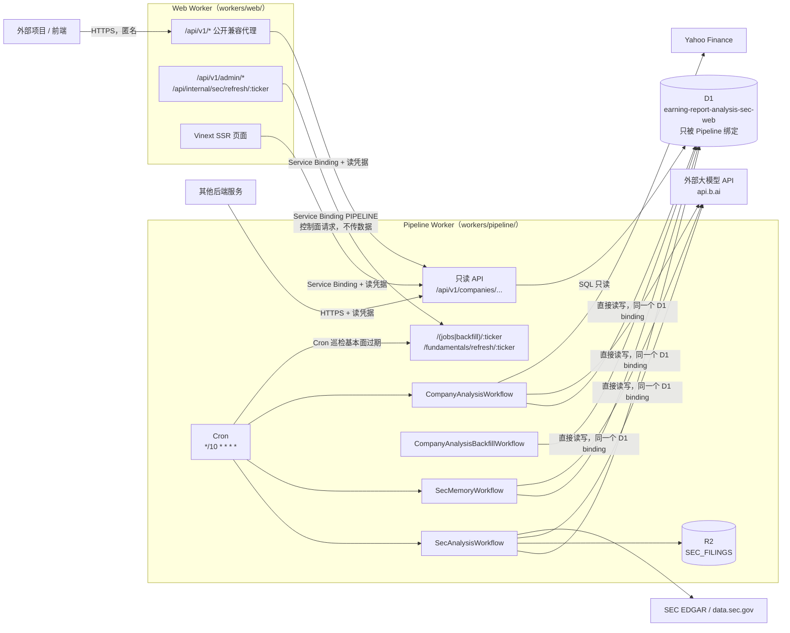
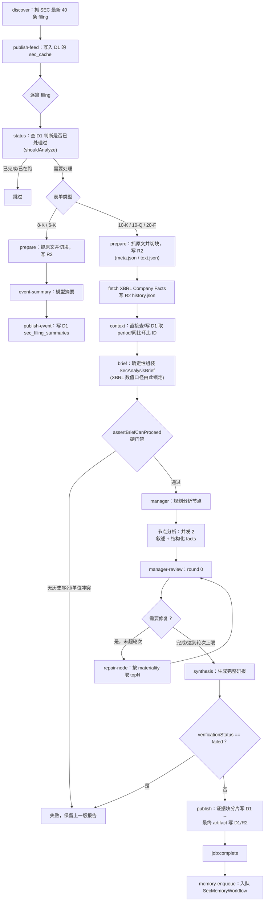

# Pipeline Worker 运行机制与外部数据接入指南

本文档面向两类读者：

1. 需要理解 **Pipeline Worker**（`workers/pipeline/`）具体怎么跑起来的人；
2. 想从**别的项目**里读取本系统产出的财报分析数据的人。

架构层面的“为什么这么设计”见 [`docs/sec-workflow-architecture.md`](sec-workflow-architecture.md)（分析质量门禁、数字口径、R2 布局的设计取舍）；本文侧重**运行流程**和**对外读取路径**，两者结合着看。

## 1. 系统总览

> **架构变更（分析后端重构）**：Pipeline Worker 现在是一个**可独立消费的财务分析后端**——它除了继续拥有写入、Cron 和 Workflows，还对外提供只读结果 API，并且是 D1 的**唯一绑定者**。Web Worker 不再绑定 D1，它的 `/api/v1/*` 变成了兼容代理。本文的 §1、§2.1、§2.7、§3、§4 已按重构后的状态更新；服务边界、API 契约、凭据与上线/回滚手册见 [`analysis-backend.md`](analysis-backend.md)。
>
> 更早一次变更（[`eb5570e`](https://github.com/Paikchu/earning-report-analysis/commit/eb5570e616b31a06da7b11b554837fdedb837ab1)）把写入方向从 Web 翻转到了 Pipeline。如果你看到的代码或旧文档里还有 `WEB_APP_ORIGIN`、`services: [{ binding: "WEB" }]`、`/api/internal/sec/context` 之类的桥接路径，那是那次重构之前的状态，已经不存在了。

系统由两个独立部署的 Cloudflare Worker 组成，现在职责按“谁拥有数据”而不是“谁面向公众”来划分：



关键约束：

- **只有 Pipeline Worker 绑定 D1**（`earning-report-analysis-sec-web`）：它既是唯一的写者也是唯一的读者，`SEC_TRACKED_TICKERS` 白名单同样只存在于它这边。**Web Worker 没有任何直接访问分析存储的能力**——不是靠代码审查约定，而是 [`tests/analysis-boundary.test.ts`](../tests/analysis-boundary.test.ts) 遍历 Web 每个入口的完整 import 图，任何直接或间接触到仓储、执行器或存储绑定的依赖都会让测试失败；[`tests/sec-write-boundary.test.ts`](../tests/sec-write-boundary.test.ts) 继续守住"`app/` 下不出现任何仓储写方法"这条更窄的规则。
- **依赖只剩一个方向**：Web 可以调 Pipeline（管理员触发分析/回填、按需刷新基本面，都是"控制面"请求——只传一个 ticker，不传数据），Pipeline 的 `wrangler.jsonc` 里**没有任何指向 Web 的绑定或地址**，物理上调不回去。两个 Worker 部署在同一个 `workers.dev` 子域下，互相用公网 hostname 访问会在边缘直接 404，所以 Web → Pipeline 这唯一剩下的方向也必须走 `services` 里配置的 Service Binding（`PIPELINE`），而不是 `fetch("https://...")`。
- Pipeline Worker 独占 R2 桶 `SEC_FILINGS`：filing 原文、分析中间产物（brief / node 结果 / manager review）都落在这里，D1 只存结构化的最终结果和任务状态，不存长文本。
- D1 的 `database_id` **直接提交在 Pipeline 的 `wrangler.jsonc` 里**（account 内的标识符，不是凭据，跟同一份配置里的 bucket 名、Worker 名同级对待），`migrations_dir` 指向它自己的 `migrations/`。Web Worker 的配置里已经没有 D1 binding，`prepare-config.ts` 会主动剥掉生成器写入的任何一个，`check-config.ts` 会拒绝仍带 D1/R2 binding 的配置。
- 生产环境入口：
  - Web Worker：`https://earning-report-analysis-sec-web.max-zhangyuchen.workers.dev`
  - Pipeline Worker（分析后端）：`https://earning-report-analysis-sec-pipeline.<subdomain>.workers.dev`（对外提供只读 API，需要读凭据，见 §4）

## 2. Pipeline Worker 运行方式

### 2.1 入口（`workers/pipeline/index.ts`）

Pipeline Worker 只有两种触发方式：

| 入口 | 用途 |
| --- | --- |
| `scheduled`（Cron） | 生产配置目前是 `*/10 * * * *`——这是[临时提高的频率](../workers/pipeline/wrangler.jsonc)，为了排查一个失联的定时任务，让失败能在几分钟内暴露而不是等到下一个整点；正常配置应为美东交易时段内每小时一次（`0 13-23 * * 1-5` + `0 0-3 * * 2-6`，覆盖 09:00–23:00 ET 周一至周五）。依次跑 `runSecRefresh` → `runSecMemorySweep` → `runCompanyAnalysisSweep` → `runFundamentalsStalenessSweep`，`Promise.allSettled` 收集结果，任一失败就 `throw AggregateError`，让失败在 Cloudflare 的调用记录里可见可告警。**Cron 表达式本身没有因为这次重构改动。** |
| `fetch` — 只读 API | `GET /api/v1/companies/:ticker/{filings,filings/:accession,analysis,fundamentals}`：对外的结果查询，用 `Authorization: Bearer <keyId>.<secret>` 认证（凭据来自 `ANALYSIS_READ_KEYS`）。**读取路径绝不写入**：不调模型、不抓外部数据、不起 Workflow、不排刷新。`GET /api/v1/openapi.json` 是公开的机器可读契约。见 §4 和 [`analysis-backend.md`](analysis-backend.md)。 |
| `fetch` — 控制面 | `POST /(jobs\|backfill)/:ticker` 是分析/回填的手动触发入口；`POST /fundamentals/refresh/:ticker` 触发一次 Yahoo 基本面同步。三者都必须带 header `x-sec-refresh-key: $SEC_REFRESH_KEY`，且 ticker 必须在 **Pipeline 自己持有**的白名单里。**读凭据无法触发其中任何一个**——控制端点只认 `SEC_REFRESH_KEY`。 |
| `fetch` — 探针 | `GET /health` 只报存活（`{"status":"ok"}`）；`GET /ready` 报依赖就绪，只读绑定和配置**是否存在**的布尔值，不发查询也不回显任何值。读取路径不需要模型凭据，所以 `AI_API_KEY` 缺失不会让 `/ready` 变红。 |

只读 API 的路由前缀 `/api/v1` 由读路由**整体接管**，并且它自己拒绝 GET/HEAD 之外的任何方法——所以这个前缀下的请求不可能落到下面的控制面 handler 上。

### 2.2 四个 Workflow

Cloudflare Workflows 提供“每个 `step.do` 自动持久化、失败自动重试、可从任意失败点恢复”的能力，四个 Workflow 分工如下：

| Workflow | Binding | 并发上限 | 由谁触发 |
| --- | --- | --- | --- |
| `SecAnalysisWorkflow` | `SEC_ANALYSIS_WORKFLOW` | 4 | Cron（每个白名单 ticker 一个实例）/ 管理接口手动触发 |
| `SecMemoryWorkflow` | `SEC_MEMORY_WORKFLOW` | 默认 | Cron 扫描到待处理 memory job 时；或 `SecAnalysisWorkflow` 发布成功后直接入队 |
| `CompanyAnalysisWorkflow` | `COMPANY_ANALYSIS_WORKFLOW` | 2 | `SecMemoryWorkflow` 提交完成后入队；或 Cron 的 backfill 候选扫描 |
| `CompanyAnalysisBackfillWorkflow` | `COMPANY_ANALYSIS_BACKFILL_WORKFLOW` | 默认 | 仅手动触发，用于恢复卡住的批次 |

每个 Workflow 的重试策略统一（`WORKFLOW_RETRY`，见 [`workflow-core.ts`](../workers/pipeline/workflow-core.ts)）：单个 `step.do` 最多重试 3 次，延迟 30s / 90s / 180s（±20% 抖动），超时 5 分钟。**从第 2 次尝试起，模型调用会自动切换到备用模型 `hy3`**（`retry-policy.ts`），只有到最后一次尝试仍失败，对应的分析节点才会被标记为失败节点而不是让整篇 filing 直接丢失。

### 2.3 SecAnalysisWorkflow：单篇 filing 怎么变成一篇研报



要点：

- **`discover`**：抓 SEC 官方 `data.sec.gov/submissions/CIK*.json`，取最新 **40 条** filing 存进 `feed`；这个 40 条窗口就是 `/api/v1/companies/:ticker/filings` 首页能命中 D1 缓存（`sec_cache`）而不用查表的范围，翻到更早的历史会落到 D1 全量表。
- **`publish-feed`**：直接调 `store.setCache` 把这 40 条摘要写进 D1 的 `sec_cache`，再逐条 `store.upsertFilingIndex` 写入 `sec_filings` 全量索引；Web Worker 和 `/api/v1/.../filings` 都是从同一个 D1 读这份缓存做首页展示，不存在"写到 Web、读也在 Web"的中间层了。
- **`selectLatestWorkflowFilings`**：非回填模式下，每次只处理“最新一篇定期报告（10-K/10-Q/20-F）+ 最近 5 篇事件公告（8-K/6-K）”，避免每次 Cron 都重新分析历史存量；回填模式（`backfill=true`）才会遍历全部 40 条里符合表单类型的 filing。
- **事件公告（8-K/6-K）走短路径**：只做「抓原文 → 模型摘要 → 发布」，不进 XBRL / brief / manager / synthesis 这一整套，因为事件公告没有结构化财务数字可比对。
- **定期报告（10-K/10-Q/20-F）走完整链路**：
  1. `prepare`：抓 filing 原文，按标题层级切成 `FilingBlock[]`，连同抓到的 SEC XBRL Company Facts 一起写 R2（`meta.json` / `text.json` / `history.json`，三份分开存是为了让后续每一步只读自己需要的那份，见 [`sec-workflow-architecture.md`](sec-workflow-architecture.md) 的 R2 布局表）。
  2. `context`：直接调 `D1SecRepository.getAnalysisContext`（先把这篇 filing 的 XBRL 历史 `saveHistory` 写进 D1，再读出来），拿到 `currentPeriodId` / `qoqPeriodId`（环比）/ `yoyPeriodId`（同比）以及公司记忆摘要——这一步以前是唯一一次对 Web Worker 的读桥接，现在是一次本地 D1 读写。
  3. `brief`：确定性代码组装 `SecAnalysisBrief`——**本期数值、同比、环比全部来自 XBRL，不经过模型**，只挑 `endDate` 落在申报期末 10 天内、口径匹配的观测值。
  4. `assertBriefCanProceed`：硬门禁，`brief.history.series` 为空，或同一序列/同一期间出现两种计量单位，直接抛错，本次运行失败但**不覆盖已发布的上一版报告**。
  5. `manager` → 节点分析（并发 2）→ `manager-review` 修复循环：Manager 先规划几个分析节点（分部收入、KPI、指引等叙述性内容），节点各自产出叙述 + 结构化 `facts`；Manager Review 判断是否需要修复，最多 `MAX_REPAIR_ROUNDS` 轮，每轮只挑 materiality 最高的 `MAX_REPAIR_NODES_PER_ROUND` 个节点重跑，两轮 review 指纹相同（没有进展）就提前收敛为 `partial`。
  6. `synthesis`：只看 Brief + 完成节点 + Manager Review 生成最终研报，**不接触 filing 原文**；`dataQuality.verificationStatus === "failed"` 时同样保留上一版报告，不发布半成品。
  7. `publish`：先把研报里实际引用到的证据块（`ev:` 前缀）分片（每片 40 条）用 `store.saveFilingBlocks` 直接写 D1，再用 `store.saveAnalysis` 写入最终 `artifact`（`verificationStatus === "failed"` 时到这一步就返回，不再往下走）；通过验证的话再调 `store.commitFinalPublication` 一次性提交研报 + 摘要并拿到 `memoryJobId`，随后异步入队 `SecMemoryWorkflow`（入队失败也不影响本次分析成功）。这些全部是同一个 D1 binding 上的直接仓储调用，不再经过任何桥接 HTTP 请求。
- **失败分类**：捕获到的错误按正则 `/No core facts|illegal evidence|Conflicting.../` 分为 `hard_failure`（结构性问题，需要人工看）和 `pipeline_error`（可重试的偶发问题），都会更新 `sec_analysis_jobs` 表并把当前 stage 记进错误行——这也是为什么中间 stage 不需要额外写 D1：Workflow 本身已经持久化了每个 step 的名字和 attempt。

**模型调用**（`callWorkerSecModel`，[`operations.ts`](../workers/pipeline/operations.ts)）：POST 到 `https://api.b.ai/v1/chat/completions`，默认模型 `glm-5.3-flash`（`SEC_ANALYSIS_MODEL`），`manager` 和 `synthesis` 阶段可以单独配置更强的 `SEC_REASONING_MODEL`。请求用 SSE 流式（`stream: true`）只是为了防止网关按 ~100s 无字节超时掐断连接，读完流后按累积的 `delta.content` 拼出完整 JSON；返回内容不是合法 JSON 时会自动追加一次“违反 schema，只返回合法 JSON”的重试。

### 2.4 SecMemoryWorkflow：从已发布研报里提炼「公司记忆」

```
memory-claim（D1SecRepository.claimMemoryJob：租约式领取一个 pending job，
             传入 Pipeline 自己的白名单，只领白名单内 ticker 的 job）
  → 从 R2 读该 job 的 source（发布时写入的完整 artifact）
  → memory-extract（模型：结构化抽取 facts / judgments，必须引用真实 evidenceId）
  → memory-commit（D1SecRepository.commitMemoryJob：写 sec_memory_items / sec_memory_events，
                   按 memoryId 合并而不是按 topicKey 文本合并）
  → 如果拿到新的 memoryVersion，入队 CompanyAnalysisWorkflow
```

以上每一步都是 Pipeline 对自己绑定的 D1 的直接调用，没有 HTTP 桥接。

**注意**：`docs/sec-workflow-architecture.md` 里强调的“Company Memory 只写不读”指的是 **filing 分析阶段**不再注入历史记忆用于生成当期研报；这里的 Memory 抽取是发布之后的异步旁路，抽取出来的记忆专门喂给下一步的 `CompanyAnalysisWorkflow`（跨期综合分析），两者用途不同。

### 2.5 CompanyAnalysisWorkflow：等基本面数据就绪后做跨期分析

这个 Workflow 生成的是「公司综合分析」（`company_analysis_runs`），依赖 Yahoo Finance 基本面数据，而 Yahoo 的数据不是实时可用的，所以设计了一个**指数退避式等待循环**（`READINESS_DELAYS = [0, 15分钟, 2小时, 8小时, 24小时, 48小时]`）：

1. 每一轮：先直接调 `syncFundamentals(env.DB, ticker)`（[`fundamentals.ts`](../workers/pipeline/fundamentals.ts)，内部是 `FundamentalSyncService` 抓 Yahoo + 写 D1，跟 Pipeline 自己 Cron 里定期跑的是同一个函数），再用 `buildCompanyAnalysisPacket` 直接查 D1 读一次「当期 packet」是否 `ready`。这一步以前是桥接调用 Web Worker 的 `/api/internal/fundamentals/refresh`（该 Worker 再用 `waitUntil` 异步抓取，失败只能进日志）；现在 Yahoo 抓取本身就是一个 durable step，失败由 Workflow 重试，调用方也会真正等到写完成，不再是"发了就不管"。
2. 6 轮都没等到就写 `insufficient_data` 状态并结束（不算失败，是明确的终态）。
3. 一旦当期 packet 就绪，再取一次「跨期 packet」（`cross_period`，给模型看历史趋势用），同样是直接查 D1。
4. 用 `ticker + periodId + memoryVersion + fundamentalsDataVersion + featureFormulaVersion + skillVersion + modelVersion + schemaVersion` 算出 `inputHash`，作为这次分析的幂等键（`company_analysis_runs.input_hash` 有唯一约束）。
5. `company-agent-*` 系列 step 跑多轮模型 Agent（[`company-analysis-agent.ts`](../workers/pipeline/company-analysis-agent.ts)），每一次模型交互都是独立的 durable step。
6. 产物同时落两处：完整过程（packet、diagnostic、决策、轮次）写 R2 `company-analysis/<ticker>/<analysisId>/run.json`；对外发布的精简版本（`overview` + 4 条 highlights）经 `D1CompanyAnalysisRepository.publish` 直接写 D1，就是 `/api/v1/companies/:ticker/analysis` 读到的内容。

**Staging 环境没有 D1 binding**（`workers/pipeline/wrangler.jsonc` 里 `env.staging` 故意不配 `d1_databases`，理由是"绝不能让 staging 写生产数据库，而它自己又没有数据库"）：如果 staging 的 Cron 意外跑到这一步，`syncFundamentals` 会直接抛 `Pipeline has no D1 binding` 而不是悄悄写错库；staging 的 `triggers.crons` 本来就是空数组，正常也到不了这一步。

### 2.6 CompanyAnalysisBackfillWorkflow

只在手动恢复场景使用：`forceIncomplete=false` 时先跑一次最新的 SEC 全量刷新，再跑一次公司分析候选扫描；`forceIncomplete=true` 时跳过 SEC 部分（避免产生不必要的模型流量），只重跑那些之前因为限流等原因没跑完的公司分析。

### 2.7 Pipeline 和 Web 之间还剩什么调用

在 [`eb5570e`](https://github.com/Paikchu/earning-report-analysis/commit/eb5570e616b31a06da7b11b554837fdedb837ab1) 之前，`/api/internal/*` 下有一整套桥接路由（`sec/feed`、`sec/context`、`sec/jobs`、`sec/memory/claim`、`sec/memory/commit`、`sec/publish`、`sec/watchlist`、`company-analysis/status`、`company-analysis/packet`、`company-analysis/publish`、`company-analysis/backfill-candidates`），Pipeline 靠它们读写 D1。**这些路由已经全部删除**，逻辑搬进了 `workers/pipeline/operations.ts`、`core.ts`、`memory-workflow.ts`、`company-analysis-workflow.ts`，变成对 `D1SecRepository` / `D1CompanyAnalysisRepository` 的直接调用（§2.3–§2.5 里描述的就是现在的样子）。

现在两个 Worker 之间**只剩 Web → Pipeline 一个方向**，而且都是"控制面"请求——只传一个 ticker，让 Pipeline 决定要不要跑，不传任何业务数据，鉴权统一用 header `x-sec-refresh-key: $SEC_REFRESH_KEY`：

| Web 侧路由 | 转发到 Pipeline 的路径 | 用途 |
| --- | --- | --- |
| `POST /api/v1/admin/companies/:ticker/refresh`（`Authorization: Bearer $SEC_ADMIN_TOKEN`） | `POST /jobs/:ticker` | 管理员手动触发一次分析 |
| `POST /api/v1/admin/companies/:ticker/backfill`（`Authorization: Bearer $SEC_ADMIN_TOKEN`） | `POST /backfill/:ticker` | 管理员手动触发一次回填 |
| `POST /api/internal/sec/refresh/[ticker]`（`x-sec-refresh-key`） | `POST /jobs/:ticker` | 供内部运维直接按 key 触发单个 ticker 的刷新，不需要 admin token；目前仓库里没有别的代码调用它，只在测试里出现，是留给运维脚本用的入口 |


**按需刷新这条路径已经删除。** 读取 fundamentals 不再触发任何刷新——那是一次藏在读请求里的写操作，而且频率由"有多少人打开页面"决定。刷新改由两处负责：Pipeline 自己的 Cron 巡检（[`fundamentals-sweep.ts`](../workers/pipeline/fundamentals-sweep.ts)，只覆盖白名单里超过 24 小时未成功抓取的股票，每次最多 2 个），以及上表最后一行那个受认证的端点。

除了上面的控制面转发，Web 还会通过同一条 Service Binding 调用 Pipeline 的**只读 API**取数据（`/api/v1/*` 代理和 SSR 页面）。那条路径携带的是读凭据 `ANALYSIS_READ_TOKEN`，不是 `SEC_REFRESH_KEY`；**走 Service Binding 本身不构成任何身份证明**——Pipeline 的 fetch handler 公网可达，所以它只看 `Authorization`，对 Web 和对外部服务一视同仁。

三个转发点用的都是 `hasSecAdminAccess` / `hasInternalSecAccess` 做的 header 校验，**已经不在 Web 这边做白名单检查**——两次检查活在两个地方正是旧架构的 bug 根源（白名单可能在两侧不一致，导致同一个请求在一边通过、另一边被拒），现在唯一的校验点是 Pipeline 收到请求后的 `assertTrackedTicker`。

这些接口**都不是给外部项目用的**——没有做通用鉴权、没有稳定性承诺、参数形状随内部实现变化。外部接入请看下一节。

## 3. 数据落在哪：D1 表结构总览

D1（`earning-report-analysis-sec-web`，SQLite）现在**只被 Pipeline Worker 绑定**——它既是唯一的写者，也是唯一的读者；Web Worker 通过 Pipeline 的只读 API 取数据，没有任何直接访问分析存储的能力（见 [`analysis-backend.md`](analysis-backend.md)）。migrations 随数据所有权一起搬到了 [`workers/pipeline/migrations/`](../workers/pipeline/migrations/)，`migrations_dir: "migrations"`；文件名和内容在迁移过程中逐字节未变，所以已经应用过的数据库不会重跑任何一条。Drizzle schema 定义在 [`db/schema.ts`](../db/schema.ts) 和 [`db/fundamentals-schema.ts`](../db/fundamentals-schema.ts)。按用途分组：

| 分组 | 主要表 | 存的是什么 |
| --- | --- | --- |
| SEC filing 原始结构 | `sec_filings`、`sec_periods`、`sec_filing_periods`、`sec_filing_blocks` | filing 元数据、期间标识（同比/环比链）、切块后的原文结构 |
| XBRL 事实与证据 | `sec_facts`、`sec_evidence`、`sec_comparisons` | 逐条 XBRL 观测值（含单位/币种/口径/来源版本）、被研报引用的原文证据块、期间对比结果 |
| 分析任务与产物 | `sec_analysis_jobs`、`sec_analysis_runs`、`sec_module_snapshots`、`sec_published_reports` | 任务去重与进度状态、每次模型运行的 token 用量、按输入哈希缓存的模块产物、**最终对外发布的研报**（`(ticker, periodId, reportVersion)` 为主键，历史版本共存） |
| 事件摘要 | `sec_filing_summaries` | 8-K/6-K 的模型摘要 |
| 公司记忆 | `sec_memory_items`、`sec_memory_events`、`sec_memory_jobs`、`sec_memory_extractions`、`sec_company_memory_threads` | 跨期持续追踪的事实/判断、变更事件、抽取任务队列与原始抽取产物 |
| 公司综合分析 | `company_analysis_runs` | `CompanyAnalysisWorkflow` 的运行状态机与最终发布内容（`overview` JSON） |
| 基本面数据（Yahoo） | `fundamental_fetch_runs`、`fundamental_periods`、`fundamental_observations`、`fundamental_observation_revisions`、`fundamental_company_profiles`、`fundamental_chart_specs` | 每次抓取的运行记录、按期间归一化的观测值（含修订历史）、公司画像、图表规格 |
| 站点缓存 | `sec_cache` | 通用 KV 式缓存（filing feed 等） |

这份表结构是**实现细节**，会随功能演进变化（比如同一版本号出现两个迁移文件 `0009_company_analysis.sql` 和 `0009_huge_enchantress.sql` 就是近期还在活跃变动的信号）。下一节说明为什么不建议外部项目直接依赖它。

## 4. 别的项目怎么读这些数据

### 4.1 为什么不能像 Postgres 那样直连数据库

Cloudflare D1 是 **Workers Binding 型**数据库：它没有对外网络端口、没有连接字符串，应用代码只能通过 Worker 里配置的 `d1_databases` binding 访问——现在只有 Pipeline Worker 绑定它（§3），这是账号内部的绑定关系，不会多出一个对外网络入口。理论上仅有的外部访问路径是 Cloudflare 官方 **D1 HTTP API** 或 `wrangler d1 execute --remote`，而这两者都要求持有**这个 Cloudflare 账号**（`max-zhangyuchen`）的 API Token，且该 Token 拥有这个 D1 实例的读权限。

也就是说这条路本质上只对**本项目的维护者**开放，"别的项目"默认不会有、也不应该去申请这个账号权限。就算拿到了权限，直接跑 SQL 也会绕开应用层的缓存失效逻辑、发布门禁（比如 `sec_published_reports` 里可能同时存在多个 `reportVersion`，哪个是"当前有效版本"是应用逻辑而不是一个列）和 schema 版本管理，migrations 还在持续变动，直接依赖表结构很脆弱。

**结论：外部项目请走只读 REST API；不要直连 D1。** 如果 API 覆盖不到你需要的数据，正确做法是提需求加一个新的 `/api/v1` 端点，而不是绕过应用层查表。

### 4.2 两个入口：分析后端本身，或这个网站的公开代理

同一批数据现在有两条读取路径，选哪条取决于你是谁：

| | **分析后端（推荐给后端服务）** | **网站的公开代理（浏览器 / 现有消费者）** |
| --- | --- | --- |
| Base URL | `https://earning-report-analysis-sec-pipeline.<subdomain>.workers.dev` | `https://earning-report-analysis-sec-web.max-zhangyuchen.workers.dev` |
| 认证 | `Authorization: Bearer <keyId>.<secret>` | 匿名 |
| CORS | 无（服务端调用） | `access-control-allow-origin: *` |
| 缓存 | `private, max-age=30, must-revalidate` + `ETag` | `public, max-age=30, stale-while-revalidate=300` |
| 依赖 | 只依赖这套 HTTP 契约 | 依赖这个网站在线 |
| 契约 | `GET /api/v1/openapi.json` | 同上（后端提供） |

两条路径**返回同一份领域数据**——代理逐字转发后端的响应体，不会再包一层。差别只在传输和调用者身份上。

**后端路径**是这次重构的重点：它不依赖这个网站，也不依赖数据库 schema。凭据的创建/轮换/吊销、状态与版本语义、完整错误码表、以及一个不 import 本仓库任何代码的独立消费者示例，都在 [`analysis-backend.md`](analysis-backend.md)；示例脚本本体是 [`examples/analysis-backend-consumer.mjs`](../examples/analysis-backend-consumer.mjs)。

下面按端点列出的响应结构对两条路径都适用。**重构后新增的字段**（都是加字段，没有改动任何已有字段的含义或类型）：

- `apiSchemaVersion`：HTTP 契约版本，和各资源自己的 `schemaVersion`、内容修订号 `reportVersion` 是三件不同的事。
- 每篇 filing 上的 `analysisRun`：**最近一次执行**的状态（`none` / `queued` / `running` / `failed` / `succeeded` / `unknown`），和描述**已发布结果**的 `analysisStatus` 分开。一次已知的失败不会再被当成"从没收录过"。
- `provenance`、`periodId`、`analysisSchemaVersion`、`contentRevision`：数据来源、报告期、以及被拆开的两半版本号。
- 公司分析上的 `latestRun` 和 `versions`，以及重新公开的 `overview.highlights[].evidenceRefs`（证据引用）。
- fundamentals 的 `refresh.scheduled` 现在**恒为 `false`**，并新增 `refresh.mode: "backend_scheduled"`——读取不再触发刷新。字段保留只为兼容。

#### `GET /api/v1/search?q=<关键词>&types=<可选>`

公司/证券目录搜索，纯本地静态数据，不查 D1。默认只返回普通股（`stock`），传 `types=stock,etf,fund,preferred,bond,etn` 放开其他类别。

```json
{ "results": [{ "symbol": "MSFT", "name": "Microsoft Corporation", "type": "stock", "...": "..." }] }
```

#### `GET /api/v1/companies/:ticker/filings?cursor=&limit=`

分页读取某公司的 SEC filing 时间线（含每篇的摘要 + 已发布研报，如果有的话）。

- `limit`：1–50，默认 20。
- `cursor`：不透明字符串，来自上一页响应的 `nextCursor`，**不要自己拼**——它是 `{filingDate, accessionNumber}` 的编码，往前翻页原样传回即可。
- 分页实现细节：首页优先命中 D1 缓存的最新 40 条窗口（见 §2.3），一次 I/O 打包返回；游标翻过这 40 条窗口之后自动落到 D1 全表查询，对调用方透明。`total` 只在**第一页**（无 `cursor`）计算并返回，深翻页的 `total` 是 `null`，客户端应该保留第一页拿到的总数，不要指望后续页会补上。

响应形状（`PublicFilingPage`）：

```json
{
  "ticker": "MSFT",
  "company": { "ticker": "MSFT", "name": "Microsoft Corporation", "cik": "0000789019" },
  "filings": [
    {
      "accessionNumber": "0000789019-26-000045",
      "ticker": "MSFT",
      "companyName": "Microsoft Corporation",
      "form": "10-Q",
      "filingDate": "2026-04-25",
      "reportDate": "2026-03-31",
      "description": "...",
      "summary": { "...": "8-K/6-K 才有的模型摘要，定期报告一般为 null" },
      "analysis": { "...": "见下方 “研报 JSON 结构”，未生成/未通过门禁时为 null" },
      "analysisStatus": "complete",
      "reportVersion": "v3",
      "edgarUrl": "https://www.sec.gov/...",
      "documentUrl": "https://www.sec.gov/..."
    }
  ],
  "nextCursor": "eyJmaWxpbmdEYXRlIjoi...",
  "total": 132,
  "checkedAt": "2026-09-04T03:10:00.000Z"
}
```

`analysisStatus` 是消费方最该关注的字段，取值：

- `complete`：研报通过验证门禁，`analysis` 有值；
- `partial`：研报存在但未完全通过验证（比如部分节点修复失败），`analysis` 仍有值，读的时候要看 `analysis.report.dataQuality`；
- `processing`：分析任务正在跑（`sec_analysis_jobs` 状态是 `queued`/`running`），`analysis` 为 `null`；
- `not_collected`：还没有任务处理过这篇 filing，不代表以后不会有。

#### `GET /api/v1/companies/:ticker/filings/:accession`

单篇 filing 详情，形状同上面 `filings` 数组的元素；未收录返回 `404 { "error": "SEC filing not found" }`。

#### `GET /api/v1/companies/:ticker/fundamentals?metrics=<可选,逗号分隔>&periodCount=<2-12,默认5>`

按季度返回 Yahoo Finance 基本面时间序列。

```json
{
  "schemaVersion": "fundamentals-api.v1",
  "catalogVersion": "...",
  "source": "yahoo_finance",
  "ticker": "MSFT",
  "status": "ready",
  "dataVersion": "sha256 摘要，内容不变则值不变，可用作客户端缓存 key",
  "fetchedAt": "2026-09-03T12:00:00.000Z",
  "stale": false,
  "partial": false,
  "qualityStatus": "complete",
  "issueCount": 0,
  "requestedPeriodCount": 5,
  "periods": [{ "periodType": "3M", "periodEnd": "2026-06-30", "currency": "USD" }],
  "series": [
    {
      "metricKey": "revenue",
      "label": "营业收入", "shortLabel": "营收",
      "category": "income_statement",
      "unitFamily": "currency", "unit": "USD", "currency": "USD",
      "basis": "reported",
      "displaySign": "positive", "defaultMark": "bar",
      "allowedTransforms": ["yoy", "qoq"],
      "available": true,
      "points": [{ "periodEnd": "2026-06-30", "valueDecimal": "76441000000", "revision": 1 }]
    }
  ],
  "refresh": { "recommended": false, "scheduled": false }
}
```

- `status: "pending"` 表示这个 ticker 从没抓过基本面数据；如果它同时也不满足刷新资格（`isRefreshEligible`，见 §4.4 的判断条件），会直接返回 `404 { "code": "FUNDAMENTALS_NOT_AVAILABLE" }`，不会触发新的抓取。
- `metrics` 传未知的 `metricKey` 会返回 `400 { "code": "INVALID_METRICS" }`；合法取值见 [`lib/fundamental-metrics.ts`](../lib/fundamental-metrics.ts) 里的 `FUNDAMENTAL_METRIC_CATALOG`。
- `valueDecimal` 是字符串而不是 number——避免大数字/精确到分的金额在 JSON 数字类型上损失精度，消费方应该用支持任意精度的方式解析（如 `BigInt`/`Decimal`），不要直接 `Number()`。

#### `GET /api/v1/companies/:ticker/analysis`

最新一期「公司综合分析」（跨期趋势解读，区别于单篇 filing 的研报）。

```json
{
  "schemaVersion": "company-analysis.v1",
  "ticker": "MSFT",
  "status": "ready",
  "analysisId": "company:MSFT:...",
  "period": { "periodId": "MSFT:FY2026Q4", "periodEnd": "2026-06-30", "label": "截至 2026年6月30日" },
  "generatedAt": "2026-07-30T08:00:00.000Z",
  "coverageStatus": "complete",
  "overview": {
    "label": "...", "headline": "...", "introduction": "...",
    "highlights": [
      { "ordinal": "01", "title": "...", "body": "..." },
      { "ordinal": "02", "title": "...", "body": "..." },
      { "ordinal": "03", "title": "...", "body": "..." },
      { "ordinal": "04", "title": "...", "body": "..." }
    ]
  }
}
```

`status` 取值：`ready`（有可用结果）/ `updating`（有结果但新一轮正在跑，当前内容可能很快过期）/ `insufficient_data`（基本面数据始终没就绪，见 §2.5）/ `unavailable`（这个 ticker 从来没跑过）。`unavailable`/`insufficient_data`/`updating` 时 `overview` 等字段为 `null`（响应仍是 200，不是错误）。

#### 管理端点（仅供本项目使用，不对外）

`POST /api/v1/admin/companies/:ticker/refresh` 和 `.../backfill` 需要 `Authorization: Bearer $SEC_ADMIN_TOKEN`，触发的是 Pipeline Worker 的生成任务，跟“读数据”无关，外部项目不需要也不应该调用。

### 4.3 研报 JSON 的结构（`analysis` 字段）

`filings` / `filings/:accession` 里的 `analysis` 字段就是 Pipeline 发布时写入 D1 的完整研报（`SecAnalysisArtifact`，定义见 [`lib/sec-types.ts`](../lib/sec-types.ts)），顶层结构：

```ts
{
  filing: SecFiling,              // 冗余的 filing 元数据
  periodId: string,
  periodScope: "quarter" | "annual",
  comparisons: ComparisonResult[],// 同比/环比对比结果
  report: PublishedSecReport,     // 正文：叙述 + keyMetrics + dataQuality，见下
  brief?: SecAnalysisBrief,       // 组装 XBRL 历史序列用的中间产物，供审计用
  managerReview?: ManagerReview,  // 修复循环的最终结果（coverageScore、未解决问题等）
  validEvidenceIds?: string[],
  artifactKeys?: Record<string, string>, // 对应 R2 里各阶段中间产物的 key，一般用不到
}
```

对消费方最重要的是 `report.dataQuality`：`verificationStatus`（`verified` 才代表完全通过门禁）、`analysisStatus`、`unresolvedQuestions`、`failedNodeIds`、`stopReason`。展示这份研报时**应该原样展示或至少标注 `dataQuality`**，不要把 `partial` 状态的内容当成和 `complete` 一样可信来用。完整字段定义见 [`lib/sec-analysis.ts`](../lib/sec-analysis.ts)。

### 4.4 未收录的 ticker 会怎样

两条独立的白名单控制着“要不要生成新内容”，别搞混：

- **SEC filing 分析（`filings` / `analysis`）**：只有 `SEC_TRACKED_TICKERS` 白名单里的 ticker 会被 Pipeline 自动生成/回填。不在白名单里的 ticker，`filings` 只返回**历史上曾经生成过、已经存在 D1 里**的报告（比如它曾经在白名单里过），没有数据就返回空数组，**不会**触发新的生成任务；`analysis` 直接返回 `status: "unavailable"`。
- **基本面数据（`fundamentals`）**：走的是另一套判断——`findSecurity(ticker)?.type === "stock"`（本地证券目录里的类型），跟 `SEC_TRACKED_TICKERS` 没有关系。不满足这个条件、又从没抓过数据的 ticker 会直接 404（`FUNDAMENTALS_NOT_AVAILABLE`），不触发抓取。

所以拿一个陌生 ticker 去测试这套 API，大概率只会看到空结果，这是预期行为，不是 bug。

**读取永远不会扩大白名单。** 无论查哪个 ticker、查多少次，都不会让它进入自动生成的范围——读路径根本不读 `SEC_TRACKED_TICKERS`。反过来，一个曾经在白名单里、现在不在了的公司，它的历史结果仍然完整可读。
