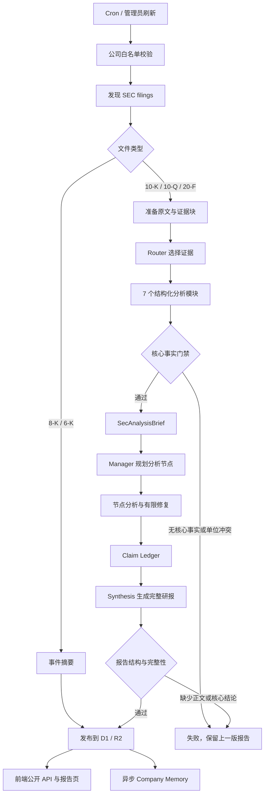

# SEC Workflow 架构

- 已删除 Synthesis 后的确定性 Claim Check、Reverse Claim AI 和 Synthesis Repair。
- Claim Ledger 仅作为 Synthesis 的结构化输入和 R2 审计产物，不再阻止发布。
- 结构化模块仍限制证据来源，拒绝无核心事实、非法证据和同一定义 KPI 的单位冲突。
- Synthesis 仍必须生成正文、3–5 条核心结论和投资观点；缺失时保留上一版报告。
