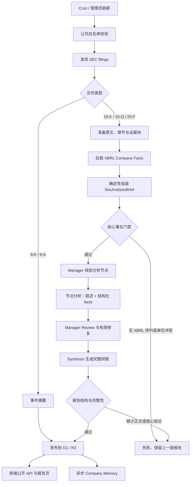

# SEC Workflow 架构

## 数字从哪来

- **本期数值、同比与环比全部来自 SEC XBRL Company Facts**（`SEC_CANONICAL_SERIES_REGISTRY`）。
  `buildSecAnalysisBrief` 只挑选 `endDate` 落在申报期末 10 天内、口径与 `periodScope` 匹配的观测值，
  比较在同一序列内部完成，因此单位、币种和基准天然可比。
- **分部收入、管理层 KPI、指引和一次性项目由分析节点产出**。节点在写叙述的同时输出 `facts`，
  `metricKey` 优先取 `allowedMetricKeys`，自定义 KPI 用 `business_kpi` 加原文 `definition`，
  每条必须引用节点实际读到的 `ev:` 证据块。
- **Synthesis 不接触 filing 原文**，只看 Brief、完成节点和 Manager Review。
  `keyMetrics` 会按 `allowedMetricKeys` 过滤，超出词表的指标被丢弃。

## 已经删除的环节

- Router 与 7 个结构化模块：它们抽取的核心财务数字 XBRL 已经提供，且更准确。
- 跨来源比较（模型抽取值 vs XBRL）：单位与量纲无法可靠对齐，改为 XBRL 序列内部比较。
- Claim Ledger：不再拦截发布之后，它只是把 Synthesis 的输入复制了一遍。
- Synthesis 后的确定性 Claim Check、Reverse Claim AI 和 Synthesis Repair。
- `buildWorkflowTrace` 与前端「全部 Workflow 节点」：改由 `dataQuality` 暴露真实的分析完整性。

## 仍然生效的门禁

- Brief 必须带有 XBRL 历史序列；同一序列、同一期间出现两种单位视为硬失败。
- 节点 facts 不能引用节点未读到的证据块。
- Synthesis 必须生成正文、3–5 条核心结论和投资观点；缺失时保留上一版报告。
- `keyMetrics` 为空或没有任何事实来源时报告标记为 `failed`，不覆盖已发布版本。
