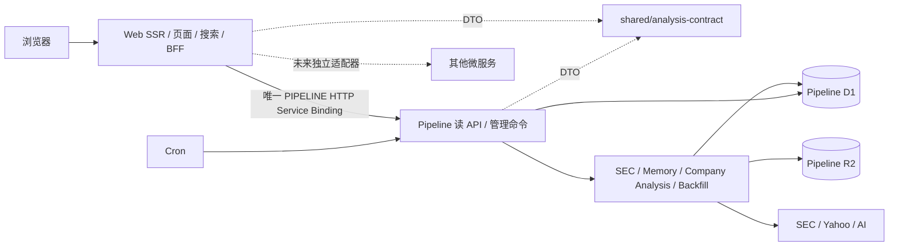

# 服务架构与后续路线

## 当前结构

Web 是页面、搜索和浏览器 BFF；Pipeline 是独立的财报分析服务。合并主分支时保留了既有读凭证、scope、限流、HTTP 缓存语义、四条 Workflow、公司分析恢复和最新图表行为。本次调整代码所有权，不回退这些能力。



```text
app/、components/                   Web 页面与交互
lib/web/                           Web 客户端、代理、鉴权、展示逻辑
shared/analysis-contract/          仅公开 DTO、错误码、协议常量
workers/web/                      Web 配置与部署脚本
workers/pipeline/
  src/sec/                        采集、分析、Memory、repository
  src/fundamentals/               Yahoo 同步、规范化、repository
  src/company-analysis/          分析 packet、计算、发布与恢复
  src/read-api/                  独立鉴权、路由、HTTP 响应
  src/read-api/contract-support/  服务端 schema 校验与 OpenAPI 生成
  src/catalog/                   Pipeline 自有证券目录快照
  src/db/                        数据模型
  src/*workflow*.ts              持久化工作流
  migrations/                    完整历史迁移链，文件内容不变
  scripts/                       迁移部署门禁
```

保留根 package 管理与 Vinext 目录约定，当前无需为了目录归属引入 npm workspace 或改变构建根。

## 依赖约束

- Pipeline 只能 import 自身、公开分析契约和第三方库。不能 import Web 或读取 Web 的数据目录，也不能回调 Web。
- Web 不能 import Pipeline，包含类型 import；没有分析 D1、R2 或 Workflow binding。
- `lib/web/analysis-client.ts` 是读 API 客户端，`analysis-backend-runtime.ts` 和 `analysis-proxy.ts` 负责环境、公共代理与限流。管理命令沿用 `sec-api.ts`；两者共用 `service-binding.ts` 和同一个 `PIPELINE` binding。
- `SEC_TRACKED_TICKERS`、定时同步、工作流恢复和分析数据只归 Pipeline。读接口严格只读，不触发模型、同步或 Workflow。
- 读凭证 `ANALYSIS_READ_TOKEN` 与 Pipeline 的 `ANALYSIS_READ_KEYS` 配对；管理命令仍用 `SEC_REFRESH_KEY`，Web 管理入口另校验 `SEC_ADMIN_TOKEN`。不能用管理密钥替代只读凭证。

`npm run check:architecture` 检查静态、动态、类型 import 与 re-export，禁止反向依赖和在契约中加入实现代码。原有递归 Web 依赖图、迁移哈希、只读路由与权限测试继续保留。`typecheck:web` 与 `typecheck:pipeline` 独立编译两端。

## 薄契约

共享目录有五个文件：`common.ts`、`filings.ts`、`report.ts`、`fundamentals.ts`、`company-analysis.ts`。只保留公开响应、证据展示结构、错误码、分页范围、read scope 和版本常量。没有 fetch、异常类、数据库行、租约或 Workflow 状态模型。

公开的 `analysisRun` / `latestRun` 是服务已有的响应字段，用来区分已发布结果与最新执行状态；保留字段兼容性，不把内部恢复参数、Agent checkpoint 或数据库模型公开。

客户端与客户端异常归 Web；服务端异常、JSON Schema 校验与 OpenAPI 文档生成归 Pipeline。已有实际响应与 schema 一致性测试继续运行，避免为了缩小目录而丢失契约校验。后续有外部消费者时，再收敛为单一 schema 源并生成类型；本次不引入新的 codegen 链。

Web 图表拥有自己的展示目录；Pipeline 的 Yahoo 映射、公式和同步保持私有。Pipeline 的证券目录快照由已有公开证券数据初始化并独立打包，避免 API 对 Web 搜索实现的隐式依赖；未来刷新此快照应作为 Pipeline 的数据维护任务，不通过 Web 回调。

## 后续阶段

| 阶段 | 触发条件 | 工作与验收 |
| --- | --- | --- |
| 当前 | 本次改造 | 文件所有权清晰；双向边界检查；独立编译；现有功能与迁移测试通过 |
| 新服务接入 | 第一个新业务服务 | `workers/<service>/src`、独立数据库与 migrations、专属公开契约；Web 一个 adapter 和一个 binding |
| 页面聚合 | 测量发现首屏请求往返是瓶颈 | 增加只读快照/聚合端点；不让 Web 编排分析步骤 |
| 独立工程 | 依赖与发布节奏分化 | 迁到 `apps/web`、`apps/pipeline` 和 `packages/*-contract`；拆 package 和 CI watch paths |
| 对外协议 | 跨仓库或跨语言消费者 | 单一 schema 源生成 OpenAPI/类型，版本兼容门禁与旧版本迁移窗口 |

不提前添加 Gateway、Queue、服务注册中心或通用 Repository。需要独立重试、削峰或多个订阅者时，再引入事件。

## 部署

沿用主分支现有部署命令和资源，不重建数据库、不修改已应用迁移、不改变运行时凭证名称。Pipeline `main` 更新为 `src/index.ts`。Web 配置仅一个 `PIPELINE` Service Binding；两端兼容性日期可独立更新。

[部署与回滚](deploy.md) / [现有分析 API 安全与运行约定](analysis-backend.md)。本次提交不执行线上部署；若仓库已配置自动部署，应确认 Pipeline 的迁移门禁与环境凭证已配置。

## 合并验证

合并 `origin/main` 后通过 351 项测试、架构门禁、独立 Web/Pipeline 类型检查、Web build 和两端部署 dry-run。历史 migrations 与主分支逐文件保持一致。ESLint 无错误（保留主分支测试辅助函数的一条 unused 参数警告）。本次没有执行线上部署。
